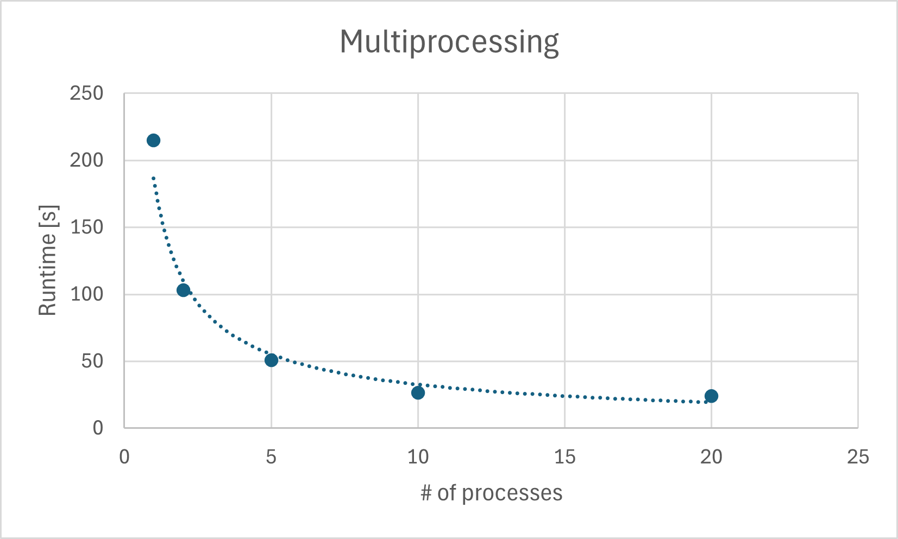

# System Programming Lab 11 and Lab 12
**Name:** Bryce Vosburg  
**Section:** 111  

---

## Overview of Implementation
For this lab, I extended the provided `mandel.c` program to support multiprocessing while keeping all original functionality unchanged. I added a new command-line option:

```
-p <num_children>
```

When this option is used, it generates 50 Mandelbrot frames while continuously zooming into the fractal. Each frame is produced by its own child process, created using `fork()` and executed using `execv()`.

### Key Features Added
- New function `run_movie_mode()` that manages all multiprocessing.
- Parent process:
  - Spawns up to `<num_children>` children at once.
  - Uses `wait()` to track and limit active children.
  - Continues launching children until all 50 frames have been generated.
- Each child process:
  - Runs the original mandel program via `execv()`.
  - Computes one image.
  - Writes output as `frame00.jpg` ... `frame49.jpg`.
- Zooming is performed using an exponential scale reduction:
  ```
  scale_n = initial_scale * (zoom_factor ^ n)
  ```
- The help menu was extended to include the new `-p` option.

---

## Runtime Results
The program was timed using the Linux `time` command for the following levels of parallelism:

- 1 process  
- 2 processes  
- 5 processes  
- 10 processes  
- 20 processes  

A graph was created showing number of processes vs total runtime in seconds.

### Runtime Graphs




---

## Discussion of Results
The runtime measurements show that multiprocessing provides a clear speedup for generating the 50 Mandelbrot frames. Increasing the number of child processes improves performance significantly at first because more frames are computed in parallel.

However, the benefit begins to taper off after around 10 processes due to:

- CPU core limits  
- Context switching overhead  
- Increased competition for memory and disk I/O  

This results in a curve with strong early speedup but lower returns at higher process counts, which matches expectations for CPU-bound parallel workloads.

The of results mulitprocessing and multithreading show that both multiprocessing and multithreading improve performance, but multiprocessing has the larger impact. Increasing the number of processes significantly reduces runtime because each process computes frames independently. Threads also provide speedup, but only up to about 4–5 threads, after which performance levels off or even becomes worse due to CPU core limits and overhead. The fastest times occur when using several processes (5–10) combined with a moderate number of threads (3–5).

---

## Movie Generation
After generating 50 frames, I used ffmpeg to convert them into a movie:

```
ffmpeg -i mandel%02d.jpg mandel.mpg
```

---